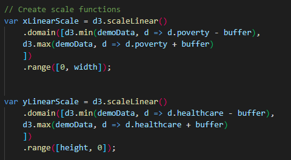

# Data-Journalism-D3

## Table of contents
* [General info](#general-info)
* [Technologies](#technologies)
* [D3 Visualization ](#d3-visualization)
* [Final Chart](#final-chart)
* [Bonus](#bonus)
* [Resources](#resources)
* [Contact](#contact)

## General info

The following data visualization displays the correlation between poverty rate and lack of healthcare. The data set is based on 2014 ACS 1-year estimates from the [US Census Bureau](https://data.census.gov/cedsci/) and the Behavioral Risk Factor Surveillance System.

The visualizations are created in `Javascript` and use `D3` code. 

## Technologies

* JavaScript
* HTML
* D3

## D3 Visualization 

To create my visualization, I first created the `svg`  shape to put my chart in. Then, I used `d3` to import my csv data file. 

I then parsed my data using `.forEach` 

Next, I created the scale functions and axis. To create a balanced visualization, I used a buffer variable when creating my X and Y axis, so the date is displayed nicely. 

To display the data when you click on a data point, I created a `circleGroup` and `textGroup`. The `circleGroup` creates the data points as pink circles. 

The ` textGroup` displays the state abbreviation over the point. I centered the state abbreviation in the circle by assigning the attribute of the `dominate-baseline` and the `text-anchor` as middle. 

To create the `click` function that display all data values, I  used a `toolTip` and associated with the `click` event. 

Lastly, I created the data for the X and Y axis. For the Y axis, I specified that the orientation would be rotated to show the title vertically. 
 

## Final Chart

The final chart is a scatter plot that shows the relationship between poverty levels and lack of healthcare per state. As you can see from the visualization, states with lower poverty rates have lower percentages of people who lack healthcare. 

`toolTip` data value display for Texas:

## Bonus

[Bonus Code](https://github.com/Ssimoes48/Data-Journalism-D3/tree/main/bonus)

I spent a long time working on a more complex visualization that compared 6 different health risk factors. I was unable to get the data points to move correctly when switching between datasets, so I did not submit it as my final assignment. Pleases see above link to repo with bonus code and index.html. 

When you select a new axis, the title becomes bold. The data points move and display the correct data when you click on the circle, but I was not able to get my state abbreviations to move with the transition. I am going to keep trying to solve this and will eventually update this repo with the more advanced visualization. 

## Resources

[Demographic CSV](https://github.com/Ssimoes48/Data-Journalism-D3/blob/main/assets/data/data.csv)

[app.js File](https://github.com/Ssimoes48/Data-Journalism-D3/blob/main/assets/js/app.js)

## Contact

[Sara Simoes](https://github.com/Ssimoes48)
